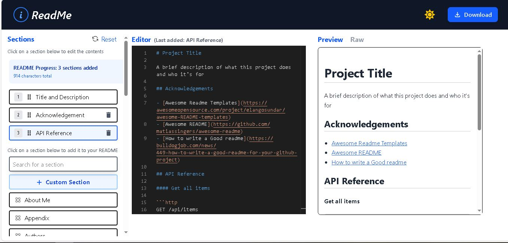
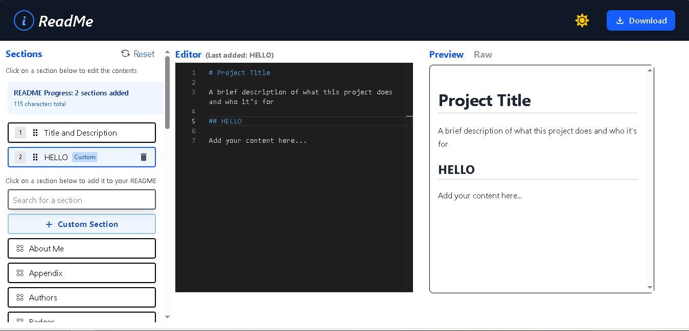
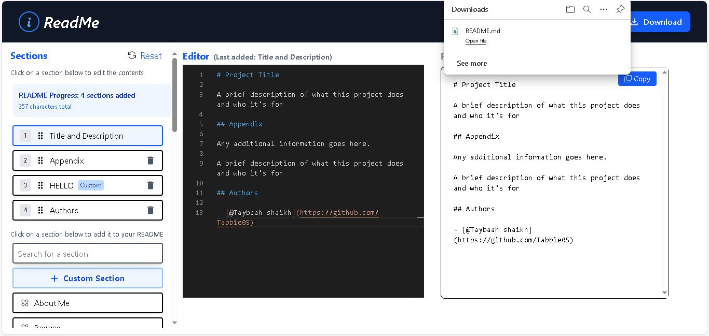

# ReadMe_Generator
  
**[SHORT_DESCRIPTION]**  
A modern React-based markdown/code editor built with MUI, Monaco Editor, Context API, and Zustand for state management.  

---

## ✨ Features
- Material-UI (MUI) components for responsive and beautiful UI
- Monaco Editor integration for rich code and markdown editing
- Global state management using React Context API and Zustand
- Real-time preview of markdown/code
- Fully customizable themes and layouts
- Easy to extend and maintain
- Draggable buttons to set the readme contents accordingly
- Download readme.md file
- Copiable raw code

---

## 🚀 Tech Stack
- **Frontend:** React.js  
- **UI Library:** Material-UI (MUI)  
- **Editor:** Monaco Editor  
- **State Management:** Zustand + React Context API  
- **Styling:** CSS-in-JS (via MUI)  
- **Build Tools:** Vite / Webpack / CRA (depending on your setup)  

---

## 📦 Installation & Setup

```bash
# 1. Clone the repository
git clone https://github.com/Tabbie05/ReadMe_Generator.git

# 2. Navigate into the project folder
cd ReadMe_Generator

# 3. Install dependencies
npm install

# 4. Start the development server
npm start
### Main Editor UI


### Markdown Preview & Custom section


### Download ReadME, Drag and change Contents, Raw Code
